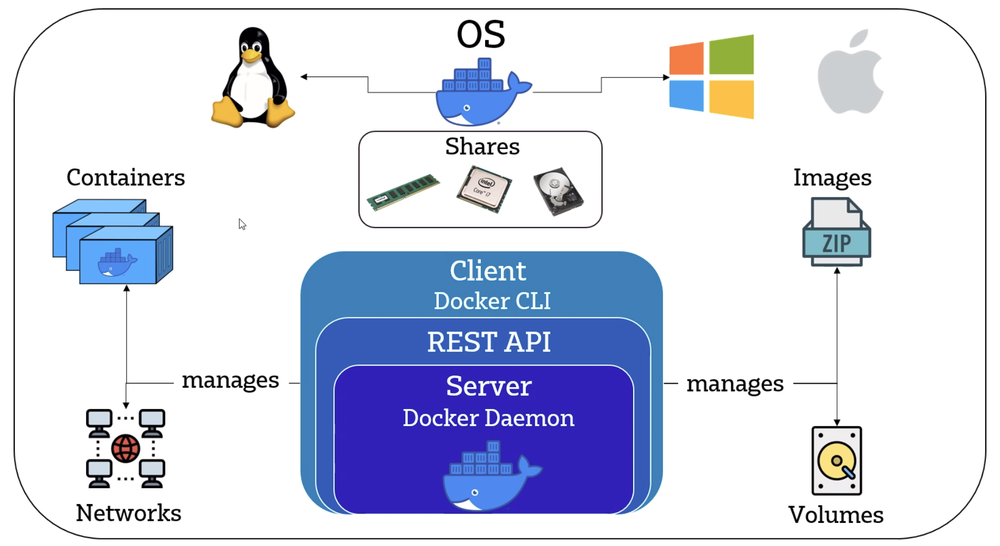
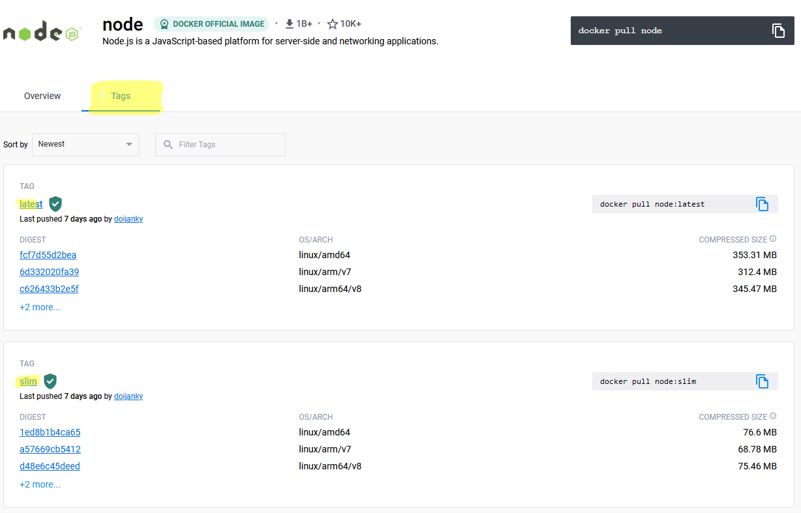
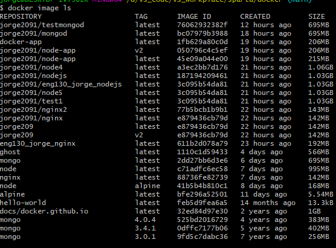
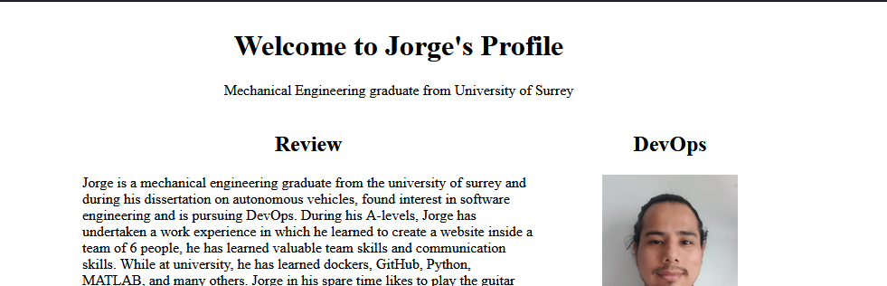

# Micro services
Microservices, is an architectural style that enables an application as a collection of 2 or more services which can be located anywhere but the instance of the other.  This makes each separate machines maintainable, independently upgradable, easily testable and loosely coupled meaning we can increase each services independently to the other meeting any demands easier and reliably. Also shown in this diagram.


### installation of docker
- run to docker docs <a href="https://docs.docker.com/desktop/install/windows-install/">website</a>
- download "docker desktop for windows" 
- open the .exe file downloaded
- follow instruction
- You may need to restart your machine
- Create a new account <a href="https://hub.docker.com/">here</a> or login if you already have one
- you can also log in using a terminal `docker login` or `docker login -u <username> -p <password>`
-  You mostly going to need to install a WS2 separately, just follow the instruction in either the docker download above or <a href="https://learn.microsoft.com/en-us/windows/wsl/install-manual#step-4---download-the-linux-kernel-update-package">here</a>
## What is Docker Containers



Lightweight compare to virtual machines. It doesn't use a lot of hardware resources as its shares those resources with the whole system. On top of these, it runs application inside "containers" and is safe and contains all the resources it is required to run the application. this container can be run in any OS as long as docker is supported. <br/>
potential error in docker with "tt""
- `alias docker="winpty docker"`

to kill a background docker
- `docker rm [process id] -f`

to run and launch docker
- `docker run -p localport:dockerport <nameOfdocker>`
- 

to build of Dockerfile
- `docker build -t jorge2091/node2 .`
- to push an image/build `docker push <name_of_image>`
- to commit a container to an already existing repos `docker commit [containername] <username>/<repo_name>:<tag>`

To download or pull container 
- `docker pull hello-world`
- to check image in your local computer `docker image ls`
we can run the command `docker` in terminal, we can get more OPTIONS
- to copy files to a container `docker cp <file> <container_id>:<path>`
- to interact with the bash of any running container `docker exec -it <container_id> bash`
- to get a specific version of a container, you can identify it by going to the "tags" and add it on the end of the name as so `docker pull node:<tag>` or to run `docker run -p 80:80 node:<tag>`



- we can also views our pulled images with `docker image ls` which also include any tags to represent them




```
Commands:
  attach      Attach local standard input, output, and error streams to a running container
  build       Build an image from a Dockerfile
  commit      Create a new image from a container's changes
  cp          Copy files/folders between a container and the local filesystem
  create      Create a new container
  diff        Inspect changes to files or directories on a container's filesystem
  events      Get real time events from the server
  exec        Run a command in a running container
  export      Export a container's filesystem as a tar archive
  history     Show the history of an image
  images      List images
  import      Import the contents from a tarball to create a filesystem image
  info        Display system-wide information
  inspect     Return low-level information on Docker objects
  kill        Kill one or more running containers
  load        Load an image from a tar archive or STDIN
  login       Log in to a Docker registry
  logout      Log out from a Docker registry
  logs        Fetch the logs of a container
  pause       Pause all processes within one or more containers
  port        List port mappings or a specific mapping for the container
  ps          List containers
  pull        Pull an image or a repository from a registry
  push        Push an image or a repository to a registry
  rename      Rename a container
  restart     Restart one or more containers
  rm          Remove one or more containers
  rmi         Remove one or more images
  run         Run a command in a new container
  save        Save one or more images to a tar archive (streamed to STDOUT by default)
  search      Search the Docker Hub for images
  start       Start one or more stopped containers
  stats       Display a live stream of container(s) resource usage statistics
  stop        Stop one or more running containers
  tag         Create a tag TARGET_IMAGE that refers to SOURCE_IMAGE
  top         Display the running processes of a container
  unpause     Unpause all processes within one or more containers
  update      Update configuration of one or more containers
  version     Show the Docker version information
  wait        Block until one or more containers stop, then print their exit codes

```
#### running our web app
node already has an image of their latest version up and running in their docker repo. Using docker pull, we can get the public repo downloaded into our local machine. Therefore this will allow us to use node pre-install inside a docker image. We can then use this image to created "Dockerfile", in other words, a new image that can run our web app application shown in our <a href="https://github.com/Jorge2091/eng130_jorge_docker/blob/main/web/Dockerfile">web</a> folder. The first command tells the file what is the starting image of our new build
```Dockerfile
FROM node
```
Then we files using `COPY` or we can copy folder using
```Dockerfile
ADD app
```
change the directory with
```Dockerfile
WORKDIR /usr/local/app
RUN npm install -g npm@latest
RUN npm install
```

this will cd the terminal to the location to make the next command work

```Dockerfile
RUN node seeds/seed.js
```
another that can work is `RUN node /usr/local/app/seeds/seed.js`
but the CMD wont start as it needs to located the app.js so the `WORKDIR` has to be inside the app folder
```Dockerfile
CMD [ "npm", "start" ]
```
image.png

### running a html page of your own
by going inside the nginx container, we can located the loaded page in `/usr/share/nginx/html/` with the name `index.html` therefore, we can edit this page or replace it entirely to load any page of our own. For this example, we can load a profile page to promote ourself as shown:



We can decorate this as much as we like and host it through the internet if we want. the way we can do this is by editing the nginx page and going to that location. Here is an example:
```Dockerfile
# start nginx
# docker pull nginx
FROM nginx 
# created index.html profile - copy to container
# ENV NODE_ENV=production
LABEL MAINTAINER=jorge
WORKDIR /app
# default location /usr/share/nginx/html
COPY index.html /usr/share/nginx/html/
COPY Jorge_reyes_photo.jpg /usr/share/nginx/html/
# docker run -d -p 80:80 name
RUN npm install

# port number
EXPOSE 80
# launch the server

CMD ["nginx", "-g", "daemon off;"]

```
### docker-compose
Docker compose is similar to ansible yaml files. and also in the same format `.yml`. it is a way to load numerous containers with running one file. On top of this, we can also set environment inside containers and link them so they can communicate with one another, we can either link them with our localhost ports, through internet ip or through containers IP. the example below is linking them by container IP.
```yaml

services: 
  mongo:
    #load from an mongo image with version 4.0.4
    image: mongo:4.0.4
    container_name: mongo
    restart: always
    # shares a file inside docker, similar to sync files in Vagrantfile. sync in real time in both local and container. only possible if container is in local machine
    volumes:
      - ./db/mongod.conf:/etc/mongod.conf
    # localPort:containerPort
    ports:
      - "27017:27017"

  app:
    container_name: app
    restart: always
    # load from a Dockerfile in the location below
    build: ./web
    # connects localPort:containerPort
    ports:
      - "3000:3000"
    # links container "mongo"
    links:
      - mongo
    environment: 
      # sets the environment so that web app can identify it
      - DB_HOST=mongodb://mongo:27017/posts
    depends_on:
      - mongo
```